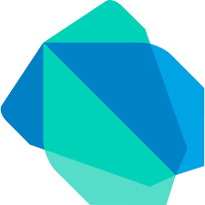

<h1 align="center">
  
</h1>

<h5 align="center">
  <code>
    <a href="https://www.linkedin.com/in/hasanaliozkan/" title="LinkedIn Profile"> LinkedIn</a></code>
  <code><a href="https://www.hackerrank.com/hasanaliozkan" title="HackerRank Profile"> HackerRank</a></code>
   <code><a href="https://globalaihub.com/members/hasanaliozkan/" title="GlobaAI Hub Profile"> GlobalAI Hub</a></code>
  <code><a href="https://stackoverflow.com/users/14295091/hasanaliozkan" title="Stack Overflow Profile">
  Stack Overflow</a></code>
  <code><a href="https://www.instagram.com/hasanaliozkan06/" title="Instagram Profile"> Instagram</a></code>
</h5>
 

  Hi, I'm Hasan Ali ÖZKAN, Computer Science Student at MSKU and Data Science Researcher. 
   
   
  🎓 I graduated from Selçuklu Atatürk Anadolu Medical Health High School
   
  💻 My areas of interest are Data Science and Artificial Intelligence, where I study and develop my skills.
   
  📚 I'm currentl conduct multiple project on Data Science.
   
  📫 How to reach me: <a href="mailto: hasanaliozkan@posta.mu.edu.tr">hasanaliozkan@posta.mu.edu.tr</a>

<h2 align="center"> 🎯 Languages & Frameworks & Tools & Abilities 🎯 </h2>
 

  <code></code>
  <code></code>
  <code></code>
  <code></code>
  <code></code>
  <code></code>
  <code></code>
  <code></code>
  <code></code>
  <code></code>
  <code></code>
  <code></code>
  <code></code>
  <code></code>
  <code></code>
  <code></code>
  <code></code>
  <code></code>
  <code></code>
  <code></code>
  <code></code>
  <code></code>
  <code></code>
 

<h2 align="center"> 📊 Stats 📊 </h2>
 

  

    
    
  

           
  

    
  

   
  

<h2 align="center">👨‍💻 Repositories 👨‍💻</h2>
 

  

      

  

      

  

      

  

      
      
<h4 align="center">
  <a href="https://github.com/hasanaliozkan-dev?tab=repositories" title="Show Repositories">🔎 Show More 🔍</a>
</h4>

